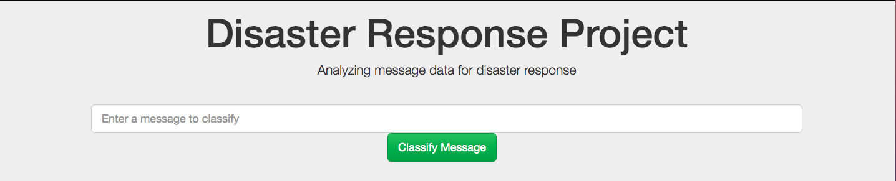

Disaster Response Pipeline



## Table of Contents
1. [Description](#description)
2. [Getting Started](#getting_started)
	1. [Dependencies](#dependencies)
	2. [Installing](#installing)
	3. [Executing Program](#executing)
	4. [Additional Material](#material)
3. [License](#license)
4. [Acknowledgement](#acknowledgement)
5. [Screenshots](#screenshots)

<a name="descripton"></a>
## Description

This Project is part of Data Science Nanodegree Program by Udacity in collaboration with Figure Eight.
The initial datasets contain real messages that were sent during disaster events.
The aim of the project is to build a web app where an emergency worker can input a new message and get classification results in several categories.

The Project is divided in the following Sections:

1. Data Processing, ETL Pipeline
2. Machine Learning Pipeline
3. Web App

<a name="getting_started"></a>
## Getting Started

<a name="dependencies"></a>
### Dependencies
* Python 3.5+
* NumPy, SciPy, Pandas, Sciki-Learn
* NLTK
* SQLalchemy
* Flask, Plotly

<a name="installing"></a>
### Installing
Clone this GIT repository:
```
git clone https://github.com/paonegri/udacity_ds2.git
```
<a name="executing"></a>
### Executing Program:
1. Run the following commands in the project's root directory to set up your database and model.

   - To run ETL pipeline that cleans data and stores in database
       `python data/process_data.py data/disaster_messages.csv data/disaster_categories.csv data/DisasterResponse.db`
   - To run ML pipeline that trains classifier and saves
       `python models/train_classifier.py data/DisasterResponse.db models/classifier.pkl`

2. Run the following command in the app's directory to run your web app.
   `python run.py`

3. Go to http://0.0.0.0:3001/

<a name="material"></a>
### Additional Material

In the **data** and **models** folder you can find two jupyter notebooks used to prepare the pipelines:
1. **ETL Preparation Notebook**
2. **ML Pipeline Preparation Notebook**

<a name="license"></a>
## License
[](https://opensource.org/licenses/MIT)

<a name="acknowledgement"></a>
## Acknowledgements

* [Udacity](https://www.udacity.com/)
* [Figure Eight](https://www.figure-eight.com/)

<a name="screenshots"></a>
## Screenshots

1. Dashboard Main Page


